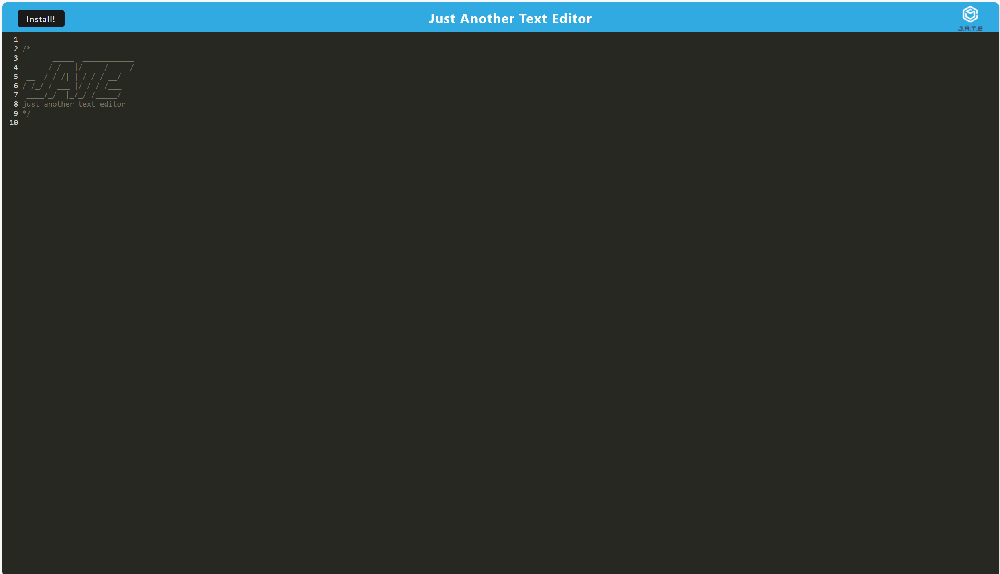

# Text-Editor

## Description

    We this challenge we are using webpacks to create a fucntioning text editor. We ofcourse can also install if need be to which is preferred actually, that way you can save your data and it wont be erased. It is a simple application to use you just have go to the browser and there will be an install button and after that you can do what you want to do.

## Project links

## Sources
    - Instructors and tutors.
    - Youtube
    - stackoverflow
    - MDN

## Screenshot 
